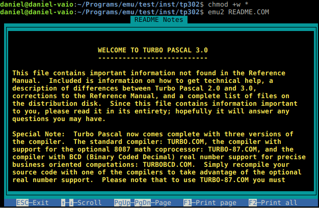
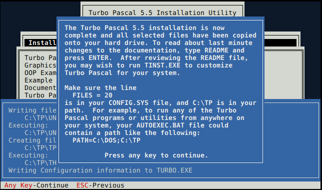
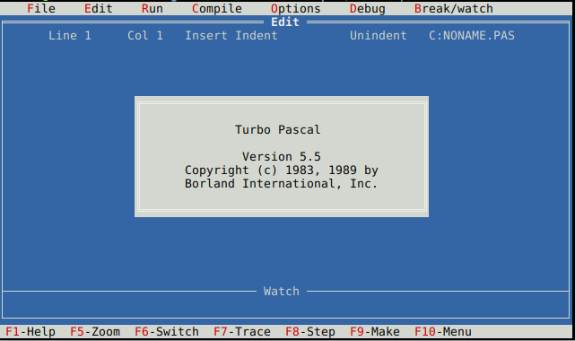

EMU2: A simple text-mode x86 + DOS emulator
-------------------------------------------

This is a simple DOS emulator for the Linux text console, supporting basic DOS
system calls and console I/O.

Using the emulator
------------------

To run a DOS `.exe` or `.com` file, simply load it with

    emu2 myprog.exe

The emulator accepts some options in the command line and more options as
environment variables, this allows child process (programs run by your DOS
program) to inherit the configuration.

The full usage is:

    emu2 [options] <prog.exe> [args...] [-- environment vars]

Options (should be placed *before* the DOS program name):
- `-h`        Shows a brief help.

- `-b addr`   Load header-less binary at given address (to load ROMs or test data).

- `-r <seg>:<ip>`  Specify a run address to start execution (only for binary loaded data).

The available environment variables are:
- `EMU2_DEBUG_NAME`    Base name of a file to write the debug log, defaults to
                       the exe name if not given.

- `EMU2_DEBUG`         List of debug options to activate, from the following:
                       `cpu`, `int`, `port`, `dos`, `video`.

- `EMU2_PROGNAME`      DOS program name, if not given use the unix name.

- `EMU2_DEFAULT_DRIVE` DOS default (current) drive letter, if not given use `C:`

- `EMU2_CWD`           DOS current working directory, use `C:\` if not given.

- `EMU2_DRIVE_`n       Set unix path as root of drive `n`, by default all drives
                       point to the unix working directory.

Simple Example
--------------

For a simple example, we can run the Turbo Pascal 3, available from the antique
software collection as a file `tp302.zip`.

First, make a new directory and unzip the file:

    $ mkdir tp302
    $ cd tp302
    $ unzip ../tp302.zip
    $ ls
    $ ls
    $ ls
    ACCESS3.BOX   CALC.PAS      DEMO-BCD.PAS  GRAPH.P     SUBDIR.PAS    TURBO.COM
    ART.PAS       CMDLINE.PAS   EXTERNAL.DOC  LISTER.PAS  TINST.COM     TURBO.MSG
    CALCDEMO.MCS  COLOR.PAS     GETDATE.PAS   README      TINST.MSG     TURTLE.PAS
    CALC.HLP      DEMO1-87.PAS  GETTIME.PAS   README.COM  TURBO-87.COM  WINDOW.PAS
    CALC.INC      DEMO2-87.PAS  GRAPH.BIN     SOUND.PAS   TURBOBCD.COM
    $ chmod +w *

The last is necessary as you will want to to modify the program files afterwards.

The main file is named "TURBO.COM", there is also a "README.COM" to read further
info, try that:

    $ emu2 README.COM

You can press exit to return to the command line. Now, you can configure the compiler,
as the README said, just load `TINST.COM`, press "S" (screen type), "0" (default), "N"
(screen does not blink) and "Q" to quit.

    $ emu2 TINST.COM

                       TURBO Pascal installation menu.
                 Choose installation item from the following:

    [S]creen type |  [C]ommand installation  |  [M]sg file path  |  [Q]uit

                             Enter S, C, M or Q: 

    Choose one of the following displays:

      0)  Default display mode
      1)  Monochrome display
      2)  Color display 80x25
      3)  Color display 40x25
      4)  b/w   display 80x25
      5)  b/w   display 40x25

    Which display? (Enter no. or ^Q to exit):

    Does your screen blink when the text scrolls? (Y/N):

Finally, we are ready to run the program:

    $ emu2 TURBO.COM
    ----------------------------------------
    TURBO Pascal system        Version 3.02A
                                      PC-DOS
                                            
    Copyright (C) 1983,84,85,86 BORLAND Inc.
    ----------------------------------------
                                            
    Default display mode                    
                                            
                                            
                                            
    Include error messages (Y/N)?           

    Logged drive: C                         
    Active directory: \                     
                                            
    Work file:                              
    Main file:                              
                                            
    Edit     Compile  Run   Save            
                                            
    Dir      Quit  compiler Options         
                                            
    Text:     0 bytes                       
    Free: 62024 bytes                       
                                            
    >                                       

Try loading a program, use "e" to edit, type "window.pas", and you are in the editor:

          Line 1    Col 1   Insert    Indent  C:WINDOW.PAS                          
    program TestWindow;                                                             
    {$C-}                                                                           
    {                                                                               
                  WINDOW DEMONSTRATION PROGRAM  Version 1.00A                       
                                                                                    
           This program demonstrates the use of windows on the IBM PC               
           and true compatibles.                                                    
                                                                                    
           PSEUDO CODE                                                              
           1.  MakeWindow        - draws window boxes on the screen                 
           2.  repeat                                                               
                 UpdateWindow 1  - scrolls the window contents up or                
                                   down for each window.                            
                 UpdateWindow 2                                                     
                 UpdateWindow 3                                                     
               until a key is pressed                                               
           3.  Reset to full screen window                                          
                                                                                    
           INSTRUCTIONS                                                             
           1.  Compile this program using the TURBO.COM compiler.                   
           2.  Type any key to exit the program.                                    
    }                                                                               
                                                                                    
                                                                                    

To exit the editor, type "CONTROL+K" and "D", in the prompt you can now type "R" to
compile and run the program.

Advanced Example
----------------

For a more advanced example, we can install and run Turbo Pascal 5.5, available from the same
antique software collection as a file `tp55.zip`.

First, make a new directory and unzip the file:

    $ mkdir tp55
    $ cd tp55
    $ unzip ../tp55.zip
    $ ls
    Disk1 Disk2

As you see, the program was distributed in two disks, and must be installed before running.

To install, let's first copy all the contents to one directory:

    $ mkdir all
    $ cp -r Disk1/* Disk2/* all/

And now, run the emulator giving the correct paths to simulate a floppy drive:

    $ EMU2_DEFAULT_DRIVE=A EMU2_DRIVE_A=all EMU2_PROGNAME=A:INSTALL.EXE emu2 all/INSTALL.EXE

Type enter, enter again to install from drive "A", again to install on a hard-drive, go down
to "Start Installation" and enter again. The install program shows an error, this is because
we copied all the content to one drive. Simply type "S" to skip all errors.

After the installation is finished, we must run the install again, to copy the missing files
from before, with the same command line:

    $ EMU2_DEFAULT_DRIVE=A EMU2_DRIVE_A=all EMU2_PROGNAME=A:INSTALL.EXE emu2 all/INSTALL.EXE

Again, press enter to the questions and go to "Start Installation", this time will complete
without errors.

You can now compile from the command line, as:

    $ EMU2_PROGNAME='C:\TP\TPC.EXE' emu2 tp/tpc.exe -- 'PATH=C:\TP'
    Turbo Pascal Version 5.5  Copyright (c) 1983,89 Borland International
    Syntax: TPC [options] filename [options]
    /B	Build all units		/$A-	No word alignment
    /Dxxx	Define conditionals	/$B+	Complete boolean evaluation
    /Exxx	EXE & TPU directory	/$D-	No debug information
    /Fxxx	Find run-time error	/$E-	No 8087 emulation
    /GS	Map file with segments	/$F+	Force FAR calls
    /GP	Map file with publics	/$I-	No I/O checking
    /GD	Detailed map file	/$L-	No local debug symbols
    /Ixxx	Include directories	/$Mxxx	Memory allocation parameters
    /L	Link buffer on disk	/$N+	8087 code generation
    /M	Make modified units	/$O+	Overlays allowed
    /Oxxx	Object directories	/$R+	Range checking
    /Q	Quiet compile		/$S-	No stack checking
    /Txxx	Turbo directories	/$V-	No var-string checking
    /Uxxx	Unit directories
    /V	EXE debug information

    $ EMU2_PROGNAME='C:\TP\TPC.EXE' emu2 tp/tpc.exe tp\\qsort.pas -- 'PATH=C:\TP'
    Turbo Pascal Version 5.5  Copyright (c) 1983,89 Borland International
    TP\QSORT.PAS(66)
    66 lines, 4384 bytes code, 2668 bytes data.

    $ emu2 tp/qsort.exe
    ....

And for the IDE, you can use:

    EMU2_PROGNAME='C:\TP\TURBO.EXE' emu2 tp/turbo.exe  -- 'PATH=C:\TP'

